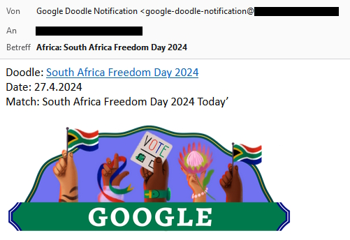

# Google Doodle Notification
Send Email Notification for certain new Google Doodles



## Table of Contents
- [Google Doodle Notification](#google-doodle-notification)
  - [Table of Contents](#table-of-contents)
  - [Installation](#installation)
    - [1. Requirements](#1-requirements)
    - [2. Download](#2-download)
    - [3. Setup](#3-setup)
  - [Usage](#usage)
    - [Run regularly](#run-regularly)
      - [Linux](#linux)
      - [Windows](#windows)
  - [Disclaimer](#disclaimer)
  - [License](#license)

## Installation
### 1. Requirements
* [Node.js](https://nodejs.org/en/)
* [Mailutils](https://mailutils.org/)

### 2. Download
```bash
git clone https://github.com/TalkLounge/google-doodle-notification
cd google-doodle-notification
npm install
```

### 3. Setup
* Copy [.env.example](.env.example) to [.env](.env)
* Configure [.env](.env)

## Usage
```
npm start
```
**Note**<br>
Chrome needs to run in headful mode, to pass the invisible reCaptcha. If you have no gui on linux, you can use [xvfb](https://manpages.ubuntu.com/manpages/xenial/man1/Xvfb.1.html)
```
xvfb-run -a --server-args="-screen 0 1280x720x24 -ac -nolisten tcp -dpi 96" npm start
```

### Run regularly
#### Linux
Via Cronjobs
```bash
crontab -e

0 */6 * * * cd ~/google-doodle-notification/ && npm start
```
#### Windows
Via [Task Scheduler](https://www.windowscentral.com/how-create-automated-task-using-task-scheduler-windows-10)

## Disclaimer
Use on your own risk.
Google may prohibit the scraping

## License
MIT